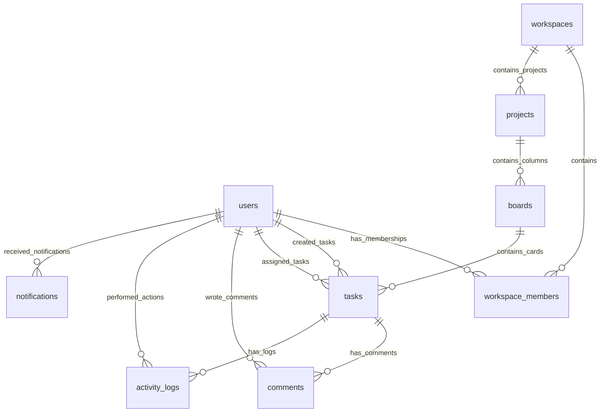

# Real-Time Collaborative Task Management & Analytics Platform

A high-performance, containerized, production-ready distributed system for task coordination, real-time collaboration, and telemetry diagnostics. It utilizes TypeScript, React, Express, PostgreSQL, Redis, Socket.IO, Nginx, Prometheus, and Grafana.

---

## 🗺️ System Architecture

```mermaid
flowchart TD
    User["👥 Client Browser (React)"] <-->|Port 80 / 443| Nginx{"🔒 Nginx Reverse Proxy"}
    Nginx <-->|Vite preview / static assets| Frontend["💻 Frontend (React Preview on 3000)"]
    Nginx <-->|Express REST API & /ready| Backend["⚙️ Backend Server (Node on 8080)"]
    Nginx <-->|/socket (Socket.IO Handshake)| Backend
    
    Backend <-->|SQL Queries / Pooled| DB[("🐘 PostgreSQL (Port 5433)")]
    Backend <-->|Rate Limit & Refresh Session| Redis[("🎯 Redis Cluster Cache (6379)")]
    Backend <-->|Horizontal Room Broadcasts| RedisPubSub[("⚡ Redis Pub/Sub Event Loop")]
    
    Prometheus["📊 Prometheus Scraper"] --->|Scrapes /metrics on 8080| Backend
    Grafana["📈 Grafana Dashboards"] --->|Queries Metrics| Prometheus
```

---

## 🛠️ Technology Stack

| Domain | Selected Technology | Rationale & Attributes |
| :--- | :--- | :--- |
| **Backend Core** | Express.js + strict TypeScript | Strict-mode static typing, structured request context tracing. |
| **Database ORM** | Prisma Client v5.14.0 | Programmatic type-safety, migration automation, index tracking. |
| **Real-Time Layer** | Socket.IO + Redis Pub/Sub | Horizontal clustering ready, client-presence syncing. |
| **Session Cache** | Redis v7 | Sub-millisecond sessions storage and login rate-limiting. |
| **Frontend UI** | React 18 + Zustand + TanStack Query | Reactive state cache, optimistic drag-drop with transaction rollback. |
| **Routing Proxy** | Nginx Alpine | TLS gateway termination, rate limit controls, unified routes. |
| **Telemetry Suite** | Prometheus + Grafana | prom-client hooks, custom gauge aggregates, automated warnings. |
| **Orchestrator** | Docker Compose v2 | Multi-stage non-root container sandboxes. |

---

## 👥 Seeded Test Accounts

The database seed script automatically populates three default test accounts with standard credentials:

| Profile Role | Username / Email | Password | Workspace Role |
| :--- | :--- | :--- | :--- |
| **Alice** | `alice` / `alice@example.com` | `Password@12345` | **Admin** (Rank 4) |
| **Bob** | `bob` / `bob@example.com` | `Password@12345` | **Manager** (Rank 3) |
| **Charlie** | `charlie` / `charlie@example.com` | `Password@12345` | **Member** (Rank 2) |

---

## 🚀 Setup & Execution Manual

### 1. Prerequisite Environment Check
Ensure the following tools are installed on your host system:
- **Docker Engine** (v20.10+) and **Docker Compose** (v2.0+)
- **Node.js** (v18.x LTS) & **npm** (v9.x+)

### 2. Configure Environment Secrets
Create a `.env` file under the `/backend` directory based on the `.env.example` configurations:
```bash
# Copy template configs
cp backend/.env.example backend/.env
```

### 3. Spin Up Multi-Container Architecture
Spin up the PostgreSQL, Redis, backend APIs, React client, Nginx gateway, Prometheus, and Grafana containers side-by-side:
```bash
# Launch entire orchestration in the background
docker compose -f infra/docker-compose.yml up --build -d
```

On start, the backend container automatically waits for PostgreSQL readiness via custom ping checks, runs migrations (`prisma migrate deploy`), and seeds Alice, Bob, Charlie, and 10 default tasks (`prisma db seed`).

Verify all containers are fully healthy:
```bash
docker compose -f infra/docker-compose.yml ps
```

---

## 🐘 Database Relational Schema



---

## 📡 Central REST API Index

All REST resources are version-scoped and prefixed under the central path: `/api/v1`

### 1. Authentication & Security Roster
- `POST /api/v1/auth/register` - Create user profile.
- `POST /api/v1/auth/login` - Authenticate profile, issues access token (900s) & cookie-based opaque refresh token.
- `POST /api/v1/auth/logout` - Revokes refresh session token inside Redis.
- `POST /api/v1/auth/refresh` - Opaque refresh session rotation and token reuse protection.
- `GET /api/v1/auth/me` - Resolves active session caller model.
- `PATCH /api/v1/auth/me` - Modifies caller parameters.

### 2. Workspace Management
- `POST /api/v1/workspaces` - Creates a new workspace hub.
- `GET /api/v1/workspaces` - Lists workspaces caller belongs to.
- `GET /api/v1/workspaces/:workspaceId` - Retrieves specific workspace summaries.
- `DELETE /api/v1/workspaces/:workspaceId` - Cascade deletes workspace context (Admin only).

### 3. Workspace Member Operations
- `POST /api/v1/workspaces/:workspaceId/members` - Invite member (Admin/Manager only).
- `GET /api/v1/workspaces/:workspaceId/members` - Lists members and roles.
- `PATCH /api/v1/workspaces/:workspaceId/members/:memberId` - Edit member role (Admin only).
- `DELETE /api/v1/workspaces/:workspaceId/members/:memberId` - Evicts member (Admin/Manager only).

### 4. Collaborative Projects & Board Columns
- `POST /api/v1/workspaces/:workspaceId/projects` - Create project.
- `GET /api/v1/workspaces/:workspaceId/projects` - List workspace projects.
- `DELETE /api/v1/workspaces/:workspaceId/projects/:projectId` - Cascade deletes project bounds.
- `POST /api/v1/projects/:projectId/boards` - Creates custom column (Done status auto-converts to task statuses).
- `GET /api/v1/projects/:projectId/boards` - List project boards in order.

### 5. Task & Timeline Operations
- `POST /api/v1/boards/:boardId/tasks` - Creates a task.
- `GET /api/v1/boards/:boardId/tasks` - List board tasks (supports paging, query filters, search).
- `PATCH /api/v1/tasks/:taskId` - Edit task contents.
- `PATCH /api/v1/tasks/:taskId/move` - Shift board column position (Done column conversion).
- `DELETE /api/v1/tasks/:taskId` - Remove task card.

### 6. Comments, Mentions & Activities
- `POST /api/v1/tasks/:taskId/comments` - Post comment (mention parser via `@username` triggers notification payloads).
- `GET /api/v1/tasks/:taskId/comments` - List task comments in chronological order.
- `GET /api/v1/tasks/:taskId/activity` - Append-only history trail of task updates (Create, Update, Move).

### 7. Core Analytics & Dashboards
- `GET /api/v1/workspaces/:workspaceId/analytics/summary` - Aggregate metrics (`completionRate`, `avgCompletionTimeHours`, `overdueTasksCount`, `completionTrends` of 7 days).
- `GET /api/v1/workspaces/:workspaceId/analytics/member/:memberId` - Resolves individual member KPIs.

---

## ⚡ WebSocket Collaborative Event Engine

Unified Socket.IO server endpoints are accessible under the path `/socket`.

### Handshake Security Gate
- The client must complete the `auth` socket handshake event **within 5 seconds** of open connection.
- If it fails, the server closes the channel with custom close code **`4001` (Auth required)**.
- If invalid credentials, the server terminates connection with code **`4003` (Invalid token)**.

### Events Exchange Matrix

| Channel Event | Source Direction | Payload Context | Action Triggered |
| :--- | :--- | :--- | :--- |
| `auth` | `Client -> Server` | `{ "token": "access_jwt" }` | Initiates JWT verification checks. |
| `auth_success` | `Server -> Client` | `{ "userId": "uuid", "email": "a@b.com" }` | Successful auth and session registration. |
| `join_board` | `Client -> Server` | `{ "boardId": "uuid" }` | Joins target board room, triggers presence cues. |
| `user_joined` | `Server -> Client` | `{ "userId": "uuid", "email": "a@b.com" }` | Multi-client presence syncing. |
| `task_edit_start`| `Client -> Server` | `{ "taskId": "uuid", "boardId": "uuid" }` | Acquires temporary editing lock cues. |
| `task_editing_started`| `Server -> Client`| `{ "taskId": "uuid", "userId": "uuid" }` | Notifies other workspace viewers. |
| `task_edit_stop` | `Client -> Server` | `{ "taskId": "uuid", "boardId": "uuid" }` | Releases editing lock cues. |
| `heartbeat` | `Client -> Server` | `void` | Pong handshake checks. |

---

## 📊 Telemetry, Metrics & System Alerts

The backend server registers and outputs standard telemetry parameters under `/metrics` scraper:

1. **`http_requests_total`** (Counter): Track requests processed across status, method, and route vectors.
2. **`http_request_duration_seconds`** (Histogram): Tracks internal request latency.
3. **`active_websocket_connections`** (Gauge): Tracks active socket nodes.
4. **`tasks_created_total`** / **`tasks_completed_total`** (Counter): Tracks platform task throughput.
5. **`db_query_duration_seconds`** (Histogram): Scopes SQL query run velocities.
6. **`notifications_sent_total`** (Counter): Number of outbound notification dispatches.

These are monitored in Grafana with high-severity automated alert definitions (e.g. `HighHttpErrorRate` >5% in 2m, `SlowDbQueries` >1s in 3m) mapped inside `infra/monitoring/alerts.yml`.
